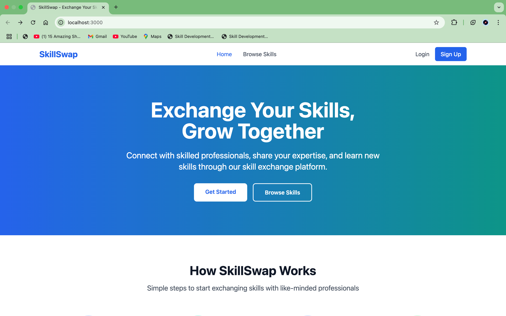
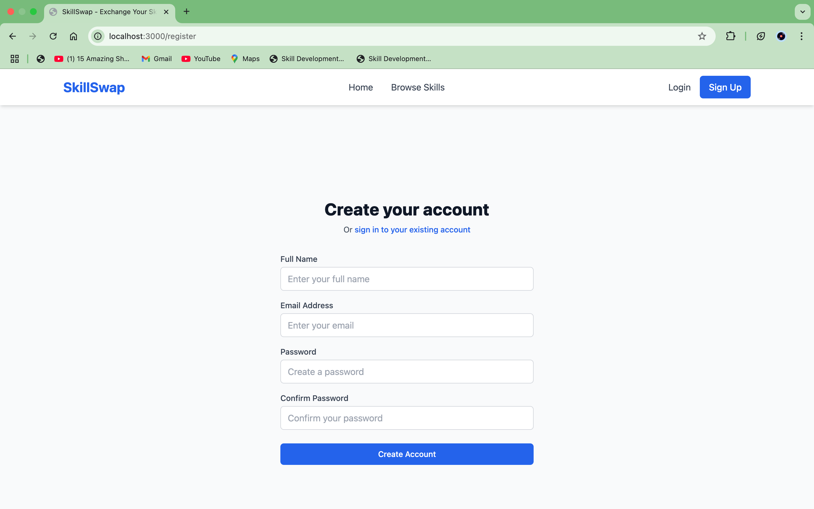
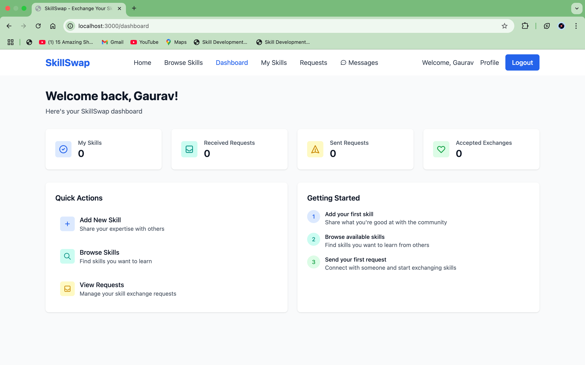
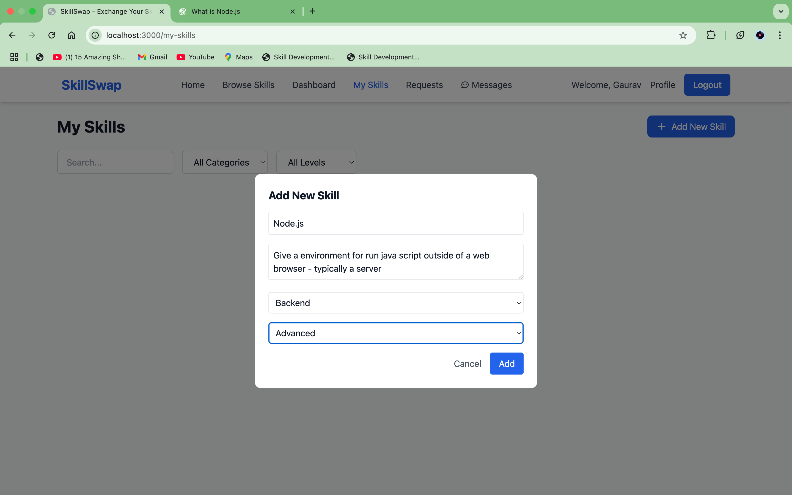
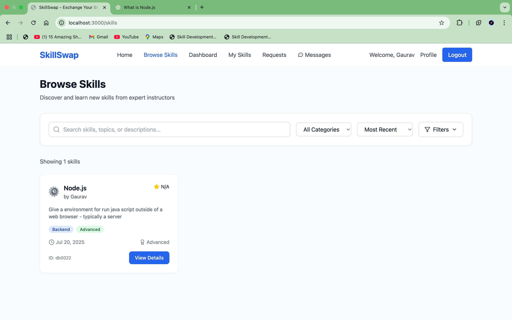
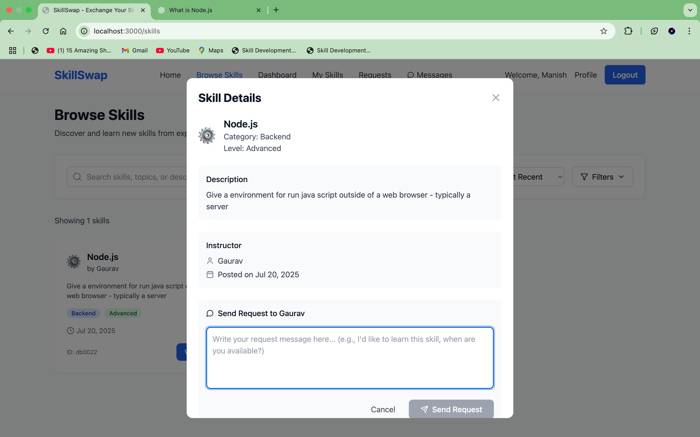
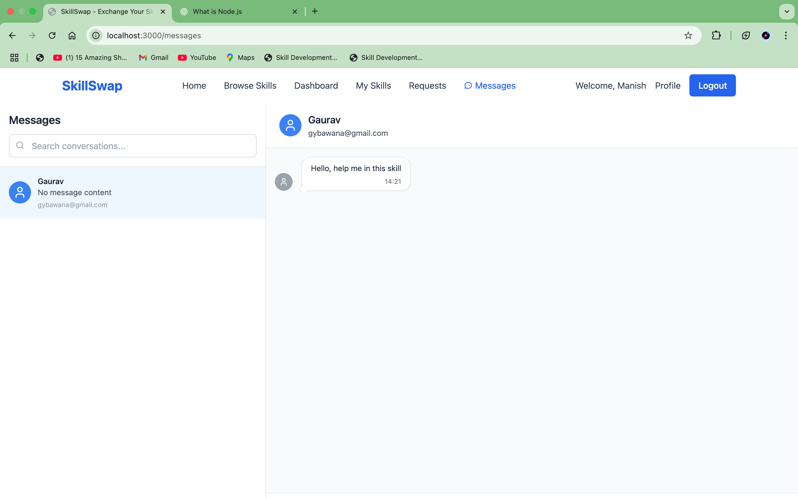
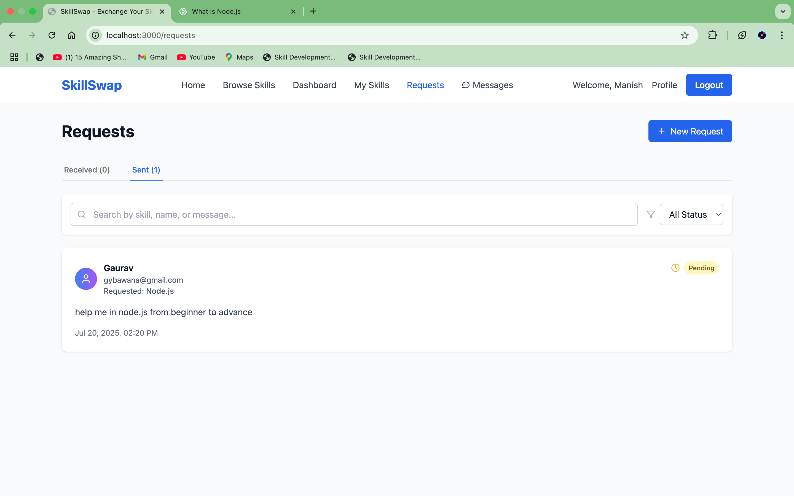
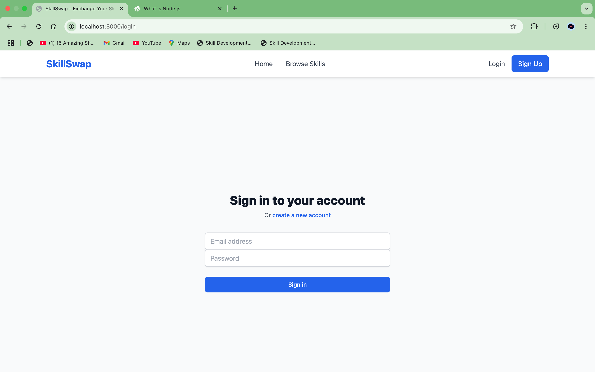

**SkillSwap - Exchange Your Skills, Grow Together 🌐**

A Skill Exchange Platform built with the MERN stack (MongoDB, Express.js, React.js, Node.js) that allows users to connect, share expertise, and learn from others. Users can offer skills, request to learn, and exchange knowledge through messaging.

**✨ Features**

✅ User Authentication (Register / Login)

✅ Post and Browse Skills

✅ Send and Manage Requests

✅ Direct Messaging between users

✅ Clean, Responsive UI

✅ Categories, Levels & Filters for Skills

**🖥️ Live Preview (Screenshots)**

### 1️⃣ Home Page  
  

### 2️⃣ Register Page  
  

### 3️⃣ Dashboard  
  

### 4️⃣ Add New Skill  
  

### 5️⃣ Browse Skills  
  

### 6️⃣ Skill Details & Request  
  

### 7️⃣ Messaging System  
  

### 8️⃣ Requests Page  
  

### 9️⃣ Login Page  
  

**🚀 Tech Stack**

Frontend	Backend	Database	Other

React.js	Node.js	MongoDB	JWT Auth

TailwindCSS	Express	Mongoose	bcrypt.js

**📌 Core Pages Overview**

Page	URL

Home	/

Register	/register

Login	/login

Dashboard	/dashboard

My Skills	/my-skills

Browse Skills	/skills

Requests	/requests

Messages	/messages

**📄 License**

This project is licensed under the MIT License.

**🌟 Show your support!**

If you liked this project, give it a ⭐️ on GitHub!
